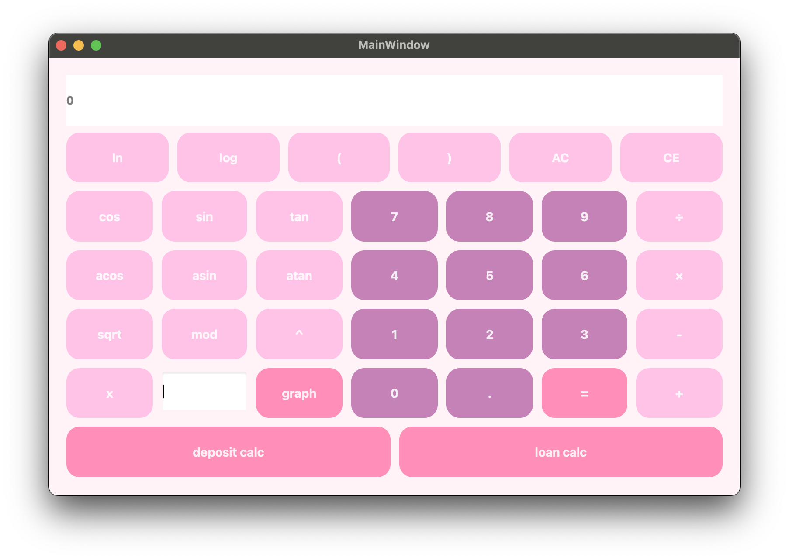
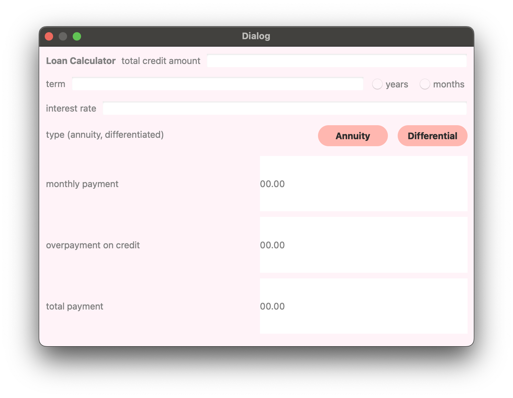
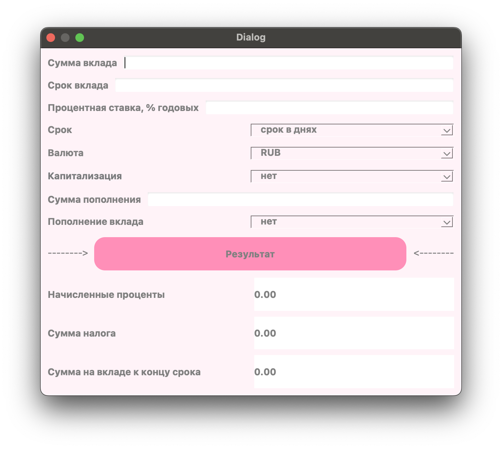
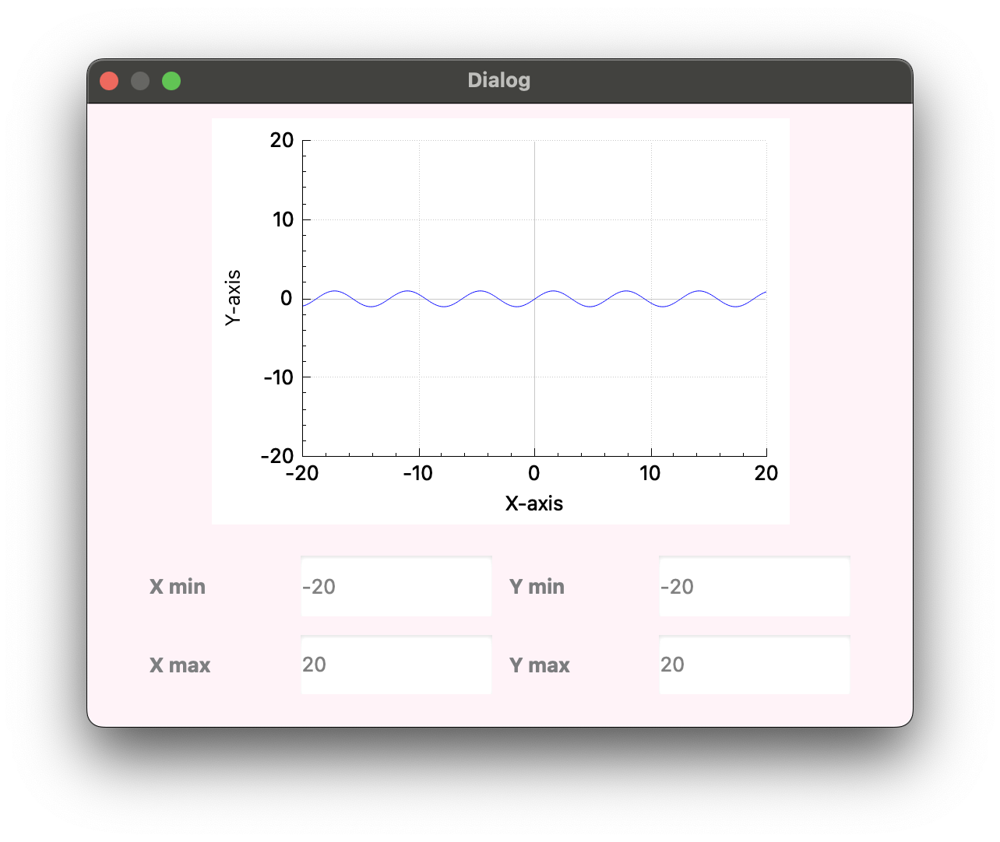

# SmartCalc_v2.0

SmartCalc_v2.0 is a powerful and versatile calculator application that combines advanced mathematical calculations with financial tools like credit and deposit calculators. Built with C++17 and a modern graphical interface, it is designed to provide a seamless and user-friendly experience for both casual and advanced users.



---

## Features

### **1. Advanced Calculator**
- **Arithmetic Expressions**: Supports complex, bracketed arithmetic expressions in infix notation.
- **Variable Substitution**: Evaluate expressions with a variable `x` by substituting a numeric value.
- **Graph Plotting**: Plot graphs for functions with variable `x`, complete with coordinate axes, adaptive grid, and labeled scales.
- **Precision**: Results are accurate to at least 7 decimal places.
- **Input**: Accepts integers, real numbers, and exponential notation, with an input limit of 255 characters.
- **Supported Operations**:
    - **Basic Arithmetic**: Addition, subtraction, multiplication, division, modulus.
    - **Exponents and Roots**: Power and square root.
    - **Trigonometric Functions**: sin, cos, tan, asin, acos, atan.
    - **Logarithmic Functions**: Natural logarithm (`ln`) and base-10 logarithm (`log`).

---

### **2. Credit Calculator**
A financial tool to help users plan and manage loans effectively:
- **Input**:
    - Loan amount.
    - Loan term.
    - Interest rate.
    - Payment type: annuity or differentiated.
- **Output**:
    - Monthly payment.
    - Total overpayment.
    - Total repayment amount.

---

### **3. Deposit Calculator**
A tool to calculate the profitability of deposits with options for interest capitalization and periodic adjustments:
- **Input**:
    - Deposit amount.
    - Term of the deposit.
    - Interest rate and tax rate.
    - Payment periodicity.
    - List of replenishments and partial withdrawals.
- **Output**:
    - Accrued interest.
    - Tax amount.
    - Final deposit balance.

---

## Technical Details

### **Code Structure**
- Written in **C++17** and adheres to **Google Style Guidelines**.
- All code is contained in the `src` folder.
- Organized using the **MVC (Model-View-Controller)** design pattern:
    - **Model**: Contains business logic.
    - **View**: Manages user interface (no business logic).
    - **Controller**: Bridges the model and view (kept minimal).

### **Testing**
- Comprehensive unit tests cover all calculation modules.
- Tests implemented with the **GTest** library.

### **Build System**
- Uses a Makefile with the following targets:
    - `all`, `install`, `uninstall`, `clean`, `dvi`, `dist`, `tests`.

### **GUI**
- Built with the **Qt library** for a responsive and visually appealing interface.
- Designed for compatibility with both Linux and MacOS.

---

## Installation and Usage

### **Build Instructions**
1. Clone the repository:
   ```bash
   git clone https://github.com/your-repo/SmartCalc_v2.0.git
   cd SmartCalc_v2.0
   ```
2. Build the application:
   ```bash
   cd src
   make all
   ```
3. Run the application:
   ```bash
   ./smartcalc
   ```

### **Installation**
To install the program system-wide:
```bash
make install
```

To uninstall:
```bash
make uninstall
```

---

## Screenshots




---

## License
SmartCalc_v2.0 is open-source and distributed under the [MIT License](LICENSE).

---

Feel free to reach out with any feedback or contributions!

https://github.com/user-attachments/assets/7aa79199-fa82-4494-85c6-c0b60713b019

